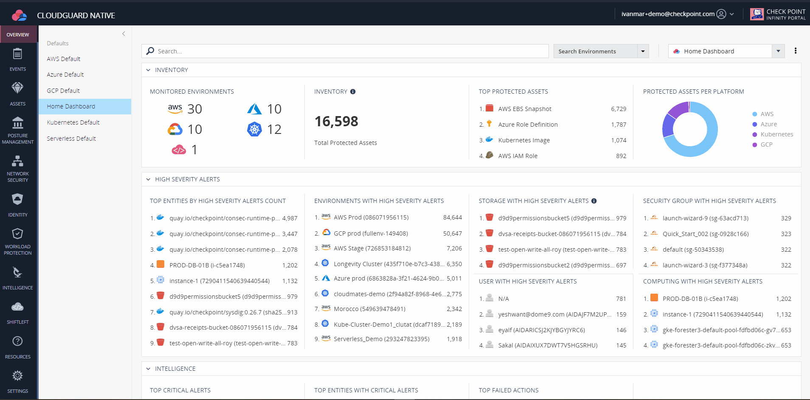
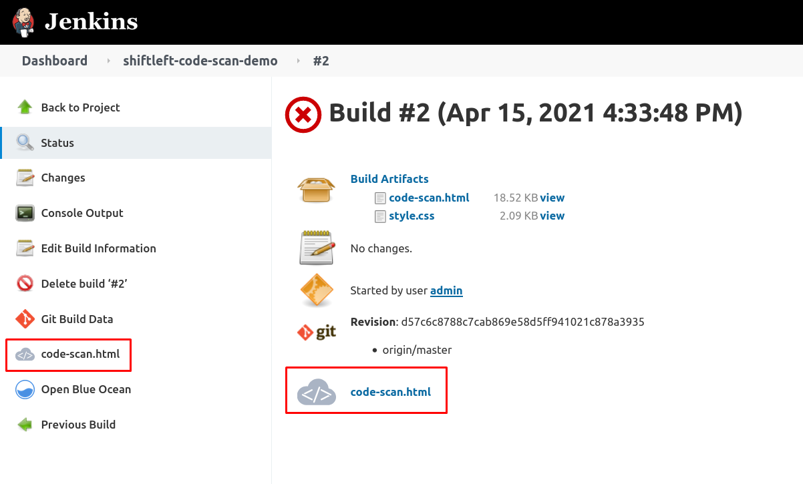

# Shiftleft Jenkins Plugin Demo

This is a repo to help you setup a PoC for the integration of Shiftleft with
Jenkins. You will need an environment with Docker to build and run the container image.

You will also need a CloudGuard account to abe able to use Shiftleft within your
Jenkins pipelines. [Register](https://secure.dome9.com/v2/register/invite) to
CloudGuard if you haven't already.

Once you have logged into your CloudGuard account, within the
Settings->Credentials menu, you can generate a new CloudGuard token.  Write
down the CloudGuard token secret, as you will not have access to it once you
close the pop-up window




## Building and running the image

To run in your Docker environment the container image, you will need to build it first:

```bash
# Build
docker build --no-cache -f Dockerfile --network host -t <give the image a name> .
# Example
docker build --no-cache -f Dockerfile --network host -t ivanmarchkp/jenkins-shiftleft:demo .
# Run
docker run -d --network=host --name jenkins-demo \
        -e CHKP_CLOUDGUARD_ID=<Token ID> \
        -e CHKP_CLOUDGUARD_SECRET=<Token Secret> \
        -e JENKINS_USER=<pick a username> \
        -e JENKINS_PASS=<pick a password> \
        <the image you just built>

# Example
docker run -d --network=host --name jenkins-demo \
        -e CHKP_CLOUDGUARD_ID=a1d3ab29-03f4-3d12-x196-cd4255555558 \
        -e CHKP_CLOUDGUARD_SECRET=XXXXXXXXXXXXXXXXXXXXXXXX \
        -e JENKINS_USER=admin \
        -e JENKINS_PASS=admin \
        ivanmarchkp/jenkins-shiftleft:demo
# Cleanup once you are done
docker stop jenkins-demo && docker rm jenkins-demo
```

After you run the container image, navigate to `http://localhost:8080`, once
Jenkins is ready you will be prompted with the user and password that you
provided (`JENKINS_USER` & `JENKINS_PASS`)

You can now run the Jenkins jobs that are preloaded within the container image
to demonstrate Shiftleft.

You will see the results of the scans in the job view:




## Known Issues

The first time you run the job _'shiftleft-code-scan-demo'_  you may see the
following error message:

> Could not parse JSON object from stdout:

Just run the job again, since certain messages appear in the stdout that are
not part of the JSON output expected by the plugin
